# 🚩 Startup - TryHackMe Write-up

## 📝 Introdução
A máquina **Startup** do TryHackMe simula um cenário real onde falhas de configuração em serviços simples (FTP) podem levar ao comprometimento total do servidor através de uma CVE conhecida como "PwnKit".

---

## 📑 Sumário
1. [Reconhecimento e Enumeração](#1-reconhecimento-e-enumeração)
2. [Acesso Inicial e Exploração](#2-acesso-inicial-e-exploração)
3. [Pós-Exploração e Movimentação](#3-pós-exploração-e-movimentação)
4. [Escalação de Privilégios (PrivEsc)](#4-escalação-de-privilégios-privesc)

---

## 1. Reconhecimento e Enumeração

### Varredura de Portas (Nmap)
Comecei uma varredura com Nmap, que revelou 3 portas abertas rodando os serviços HTTP, SSH e FTP. Notei que era possível logar como "anonymous" no FTP; então, utilizei o Nmap novamente com a flag `-sC` para coletar informações mais detalhadas do SSH e FTP que poderiam ser importantes para a invasão.

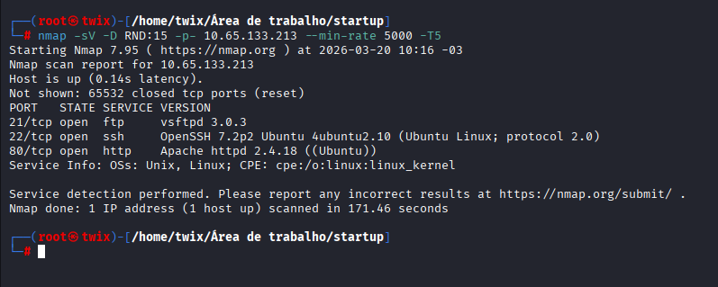
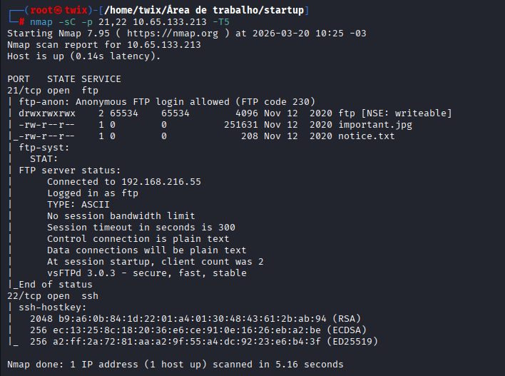

### Enumeração Web (Gobuster)
No servidor Web, utilizei o Gobuster para realizar um brute-force de diretórios e localizei o diretório `/files`, que dava acesso direto aos arquivos enviados via FTP.

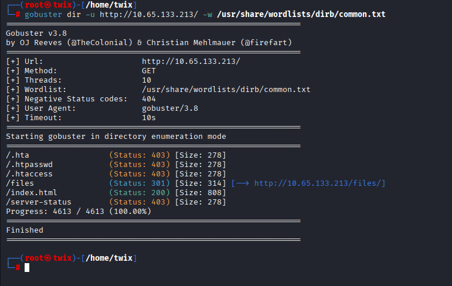
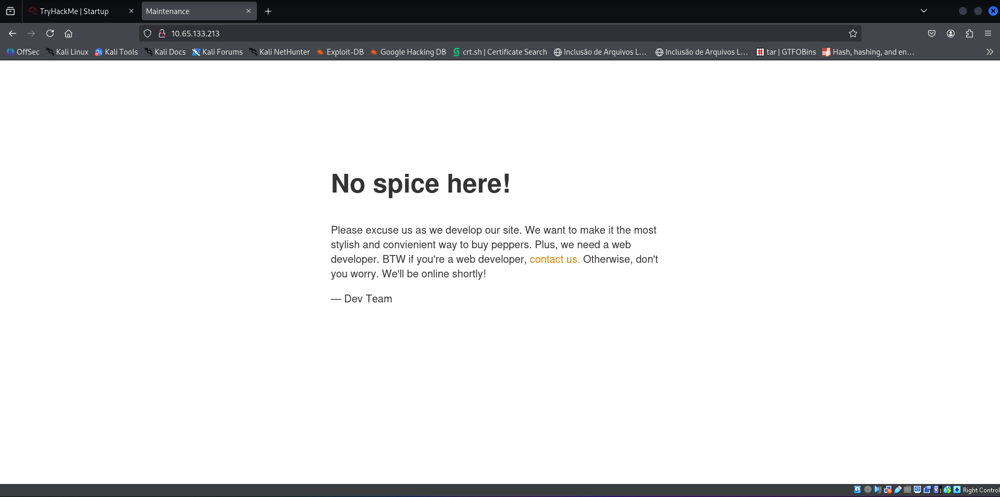

---

## 2. Acesso Inicial e Exploração

### Vetor de Ataque: Upload Bypass
Aproveitando a permissão de escrita no diretório `/ftp`,acessei o FTP com usuario anonymous e realizei o upload de uma **reverse shell em PHP**. Em seguida, iniciei o Netcat no meu terminal para aguardar a conexão reversa.

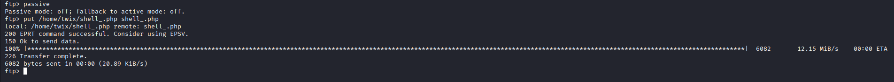
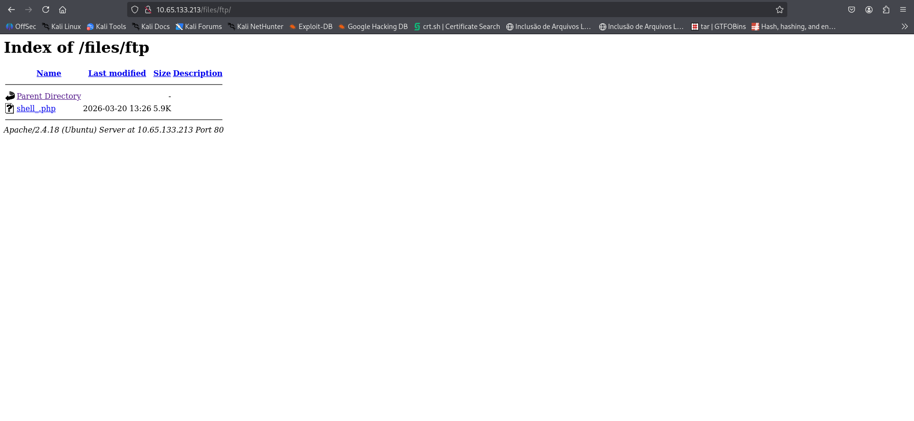

### Ganho de Shell
Acessei o arquivo enviado pelo navegador para executar o payload. Consegui estabelecer a conexão com sucesso e, logo após isso, estabilizei a shell utilizando comandos de Python para obter um terminal interativo.

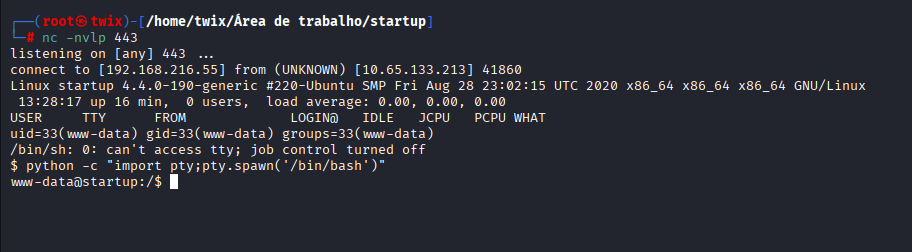

---

## 3. Pós-Exploração e Movimentação

Investigando o sistema de arquivos, localizei a primeira flag (`recipe.txt`).Comecei a procura por binários com permissão **SUID** para encontrar um vetor de escalação de privilégios (*Privilege Escalation*). Através de pesquisas, identifiquei que o binário `pkexec` era vulnerável à **CVE-2021-4034**, também conhecida como **"PwnKit"**. 

Essa falha ocorre porque o `pkexec` não processa corretamente a contagem de argumentos, permitindo que um invasor injete variáveis de ambiente perigosas para executar código como root. de forma mais explicativa simples:
É um erro de contagem que permite a um usuário comum, que não tem permissões de admin, enganar o sistema e virar administrador instantaneamente. Ele pode após isso, ler qualquer arquivo do sistema, podendo roubar senhas, logins e dados confidenciais; espionar tudo o que a vítima digita e acessa, e até realizar um sequestro de dados (Ransomware), nesse cenário, o criminoso bloqueia o acesso ao sistema e exige resgates altíssimos em criptomoedas, causando prejuízos financeiros e operacionais imensos para qualquer empresa.

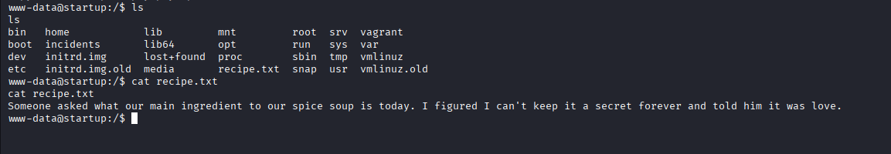
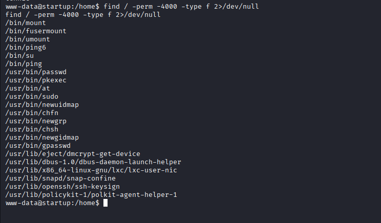

---

## 4. Escalação de Privilégios (PrivEsc)

### CVE-2021-4034 (PwnKit)
Utilizei o framework **Metasploit**, que já possui um módulo dedicado para explorar essa vulnerabilidade. Com a execução do exploit, obtive acesso root instantâneo, permitindo a leitura das flags finais.

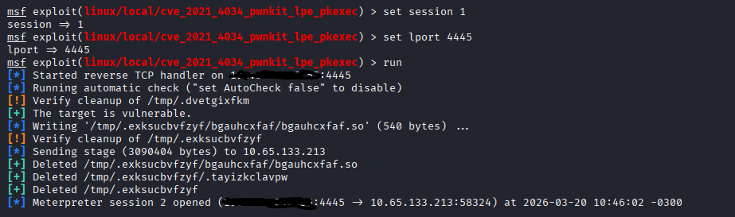
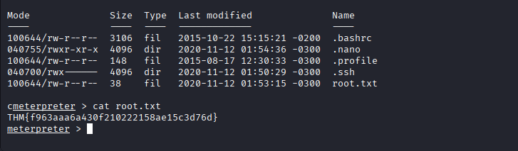
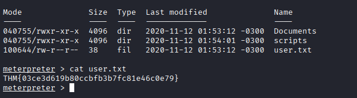

---

> **Nota Técnica:** Para mitigar essas falhas, é essencial manter o sistema operacional atualizado (patch do PolicyKit) e configurar o serviço FTP para proibir logins anônimos com permissão de escrita em diretórios sensíveis. Nesse caso, um simples serviço com login anônimo gerou comprometimento total de um servidor.
